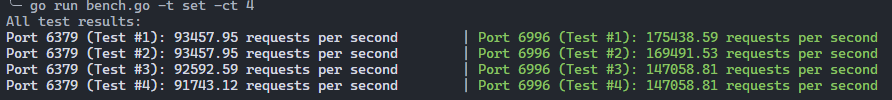
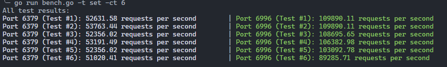

# mini-redis
Multi-threaded redis implemented in C++, support `SET` and `GET` command using RESP2.

## How to use?
1. `cmake -B build`
2. `cd build && make`
3. `cd bin`
4. `./mini-redis -w [number of worker threads]`

## How to run benchmark?
### Compare to single-thread redis
Just run it, use `-t` to specify the command you want to test.
1. `go run bench.go -ct [concurrent times to test]`

## How to compare with multi-threaded Redis?
1. Make sure you had enabled `io-threads`
2. `go run bench.go -t [redis command to test] -ct [concurrent times to test]`
3. Results are displayed on screen

## Experiment Result
- Ubuntu 22.04.3 TLS
- Redis v=7.2.3 `io-threads 4`
- 4 workers bench

- 6 workers bench

The overall RPS of mini-redis is **60% and 100% higher than Redis** under 4 worker threads and 6 worker threads seperately!
